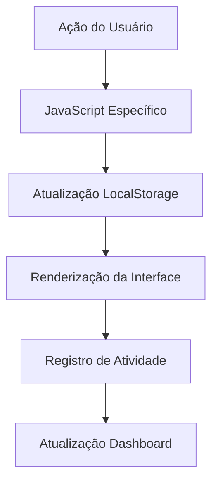

# 🦉 StudyPal - Sistema de Gestão de Estudos

> **Seu companheiro digital para organizar estudos, controlar o tempo e acompanhar o progresso acadêmico.**

## 📋 Índice

- [Sobre o Projeto](#sobre-o-projeto)
- [Estrutura de Pastas](#estrutura-de-pastas)
- [Funcionalidades](#funcionalidades)
- [Tecnologias Utilizadas](#tecnologias-utilizadas)
- [Como Usar](#como-usar)
- [Arquitetura do Código](#arquitetura-do-código)
- [Contribuição](#contribuição)

## 🎯 Sobre o Projeto

O **StudyPal** é uma aplicação web desenvolvida para estudantes que desejam:
- Organizar suas matérias e horários de estudo
- Utilizar a técnica Pomodoro para melhor concentração
- Acompanhar seu progresso e definir metas
- Manter-se motivado com mensagens inspiradoras
- Ter um dashboard completo de suas atividades

## 📁 Estrutura de Pastas

A organização do projeto segue padrões profissionais da indústria:

```
IC-ensino medio/
├── 📄 index.html                    # Página principal (landing page)
├── 📄 README.md                     # Documentação do projeto
├── 📁 assets/                       # Recursos estáticos
│   ├── 📁 css/                      # Folhas de estilo
│   │   └── 📄 styles.css            # CSS principal unificado
│   ├── 📁 js/                       # Scripts JavaScript
│   │   ├── 📄 main.js               # Funções compartilhadas
│   │   ├── 📄 agenda.js             # Lógica da agenda
│   │   ├── 📄 dashboard.js          # Lógica do dashboard
│   │   ├── 📄 methods.js            # Métodos de estudo
│   │   └── 📄 progress.js           # Sistema de progresso
│   └── 📁 images/                   # Imagens (para uso futuro)
└── 📁 pages/                        # Páginas da aplicação
    ├── 📄 agenda.html               # Gestão de matérias e horários
    ├── 📄 dashboard.html            # Visão geral e estatísticas
    ├── 📄 methods.html              # Técnicas de estudo e Pomodoro
    └── 📄 progress.html             # Acompanhamento de progresso
```

### 🗂️ Detalhamento das Pastas

#### `/assets/`
Contém todos os recursos estáticos da aplicação:

- **`/css/`**: Folhas de estilo CSS
  - `styles.css`: CSS principal com todas as regras de estilo, variáveis CSS customizadas e responsividade

- **`/js/`**: Scripts JavaScript modulares
  - `main.js`: Funções utilitárias compartilhadas entre páginas
  - `agenda.js`: Gerenciamento de matérias, horários e cronograma semanal
  - `dashboard.js`: Estatísticas, atividades recentes e mensagens motivacionais
  - `methods.js`: Timer Pomodoro e técnicas de estudo
  - `progress.js`: Sistema de metas, gráficos de progresso e exportação de dados

- **`/images/`**: Pasta preparada para futuras imagens e ícones

#### `/pages/`
Páginas secundárias da aplicação:

- **`agenda.html`**: Interface para cadastro e gerenciamento de matérias
- **`dashboard.html`**: Painel principal com visão geral do progresso
- **`methods.html`**: Técnicas de estudo e timer Pomodoro
- **`progress.html`**: Acompanhamento detalhado do progresso e metas

## ✨ Funcionalidades

### 🏠 Página Principal (`index.html`)
- Landing page atrativa com apresentação do StudyPal
- Navegação para todas as seções
- Design responsivo e moderno

### 📊 Dashboard (`dashboard.html`)
- **Estatísticas em tempo real**: Número de matérias, progresso semanal, sequência de estudos
- **Atividades recentes**: Histórico das últimas ações realizadas
- **Ações rápidas**: Botões para completar tarefas, iniciar Pomodoro e ver mensagens motivacionais
- **Mensagens motivacionais**: Sistema de incentivo personalizado

### 📅 Agenda (`agenda.html`)
- **Cadastro de matérias**: Nome, horário, dia da semana, duração e observações
- **Lista de matérias**: Visualização organizada com opções de completar/remover
- **Cronograma semanal**: Grade visual com todas as matérias por dia
- **Dicas de organização**: Sugestões para uma agenda eficiente

### 🧠 Métodos de Estudo (`methods.html`)
- **Timer Pomodoro**: Sessões de 25 minutos com intervalos automáticos
- **Técnicas de estudo**: 
  - Técnica Feynman
  - Recordação Ativa
  - Repetição Espaçada
  - Mapas Mentais
- **Notificações**: Alertas visuais e do navegador para controle de tempo

### 📈 Progresso (`progress.html`)
- **Estatísticas detalhadas**: Horas totais, matérias ativas, tarefas completas
- **Gráfico de progresso**: Visualização do desempenho semanal
- **Sistema de metas**: Definição e acompanhamento de objetivos
- **Exportação de dados**: Backup completo em formato JSON

## 🛠️ Tecnologias Utilizadas

- **HTML5**: Estrutura semântica e acessível
- **CSS3**: 
  - Variáveis CSS customizadas
  - Grid e Flexbox para layouts responsivos
  - Animações e transições suaves
- **JavaScript ES6+**:
  - Módulos separados por funcionalidade
  - LocalStorage para persistência de dados
  - APIs de notificação do navegador
  - Intersection Observer para animações

## 🚀 Como Usar

### Instalação
1. Clone ou baixe o repositório
2. Abra o arquivo `index.html` em seu navegador
3. Comece a usar imediatamente - não requer instalação adicional

### Primeiro Uso
1. **Acesse o Dashboard** para ver a visão geral
2. **Vá para Agenda** e cadastre suas primeiras matérias
3. **Experimente os Métodos** usando o timer Pomodoro
4. **Acompanhe seu Progresso** definindo metas e registrando estudos

### Dicas de Uso
- Use o **LocalStorage** - seus dados ficam salvos no navegador
- **Exporte regularmente** seus dados na página de Progresso
- **Permita notificações** para aproveitar o timer Pomodoro
- **Seja consistente** - use diariamente para melhores resultados

## 🏗️ Arquitetura do Código

### Princípios de Organização

#### 1. **Separação de Responsabilidades**
- **HTML**: Estrutura e conteúdo semântico
- **CSS**: Apresentação visual e responsividade
- **JavaScript**: Lógica de negócio e interatividade

#### 2. **Modularização JavaScript**
```javascript
// main.js - Funções compartilhadas
- getRandomMotivationalMessage()
- addRecentActivity()
- formatTimeAgo()
- initializeAnimations()

// agenda.js - Específico da agenda
- renderSubjects()
- renderWeeklySchedule()
- toggleSubjectCompletion()

// dashboard.js - Específico do dashboard
- updateDashboardStats()
- renderRecentActivities()
- showWelcomeMessage()

// methods.js - Métodos de estudo
- startPomodoro()
- toggleTimer()
- completePhase()

// progress.js - Sistema de progresso
- renderProgressChart()
- addNewGoal()
- exportProgress()
```

#### 3. **Sistema de Dados**
- **LocalStorage**: Persistência local no navegador
- **Estrutura JSON**: Dados organizados e fáceis de manipular
- **Backup/Restore**: Sistema de exportação e importação

#### 4. **Design Responsivo**
- **Mobile-first**: Desenvolvido priorizando dispositivos móveis
- **Grid CSS**: Layout flexível e adaptável
- **Variáveis CSS**: Fácil manutenção de cores e espaçamentos

### Fluxo de Dados



## 🎨 Sistema de Cores

O StudyPal usa um sistema de cores consistente definido em variáveis CSS:

```css
:root {
    --purple-primary: #7c3aed;    /* Cor principal */
    --purple-light: #a855f7;      /* Acentos */
    --purple-dark: #5b21b6;       /* Títulos */
    --purple-ultra-light: #f3e8ff; /* Fundos */
    --success: #059669;           /* Sucesso */
    --warning: #d97706;           /* Aviso */
    --error: #dc2626;             /* Erro */
    --gray-light: #f3f4f6;        /* Fundos claros */
    --gray-medium: #6b7280;       /* Textos secundários */
    --gray-dark: #374151;         /* Textos principais */
}
```

## 🔧 Personalização

### Adicionando Novas Funcionalidades

1. **Nova Página**:
   - Crie o arquivo HTML em `/pages/`
   - Adicione o CSS específico em `/assets/css/styles.css`
   - Crie o JavaScript em `/assets/js/nova-funcionalidade.js`

2. **Nova Técnica de Estudo**:
   - Adicione no arquivo `/assets/js/methods.js`
   - Inclua o card na interface em `methods.html`

3. **Novos Tipos de Dados**:
   - Modifique a estrutura no LocalStorage
   - Atualize as funções de importação/exportação

### Modificando Estilos

- **Cores**: Altere as variáveis CSS em `:root`
- **Layout**: Modifique as classes CSS existentes
- **Responsividade**: Ajuste os media queries

## 📱 Compatibilidade

- ✅ **Chrome/Edge** 88+
- ✅ **Firefox** 85+
- ✅ **Safari** 14+
- ✅ **Mobile browsers** (iOS Safari, Chrome Mobile)

## 🤝 Contribuição

Para contribuir com o projeto:

1. **Fork** o repositório
2. **Crie uma branch** para sua feature (`git checkout -b feature/nova-funcionalidade`)
3. **Commit** suas mudanças (`git commit -am 'Nova funcionalidade'`)
4. **Push** para a branch (`git push origin feature/nova-funcionalidade`)
5. **Abra um Pull Request**

### Padrões de Código

- Use **nomes descritivos** para variáveis e funções
- **Comente** código complexo
- **Teste** em diferentes navegadores
- **Mantenha** a consistência de estilo


**StudyPal** - Transformando sua jornada de estudos! 🚀📚

*Desenvolvido com ❤️ para estudantes que buscam excelência acadêmica.*
